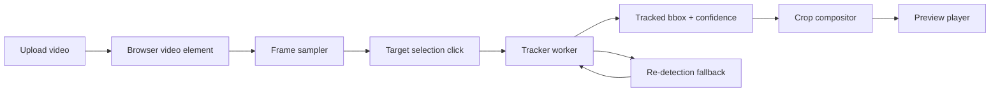

# Video Object Cropping Design

## Goal

Build a browser-based web app where a user uploads a video, selects one person in the frame, and gets a live preview of a crop that follows that person as they move.

## MVP Scope

- Upload local video files in the browser.
- Display the video in a preview player.
- Let the user click a person to select the target object.
- Track the selected person across frames.
- Render a preview crop that follows the target automatically.
- Show basic tracking state so the user knows whether the app is locked on or has lost the target.

## Explicit Non-Goals

- No server-side processing in the first version.
- No export/render-to-file workflow yet.
- No multi-person identity persistence across scenes.
- No timeline editing, manual keyframes, or advanced trim tools.
- No live webcam capture.

## Recommended Approach

Use a client-side tracking pipeline in a single-page app:

1. Decode the uploaded video in the browser.
2. Let the user click a person in the preview to establish the target.
3. Convert that click into a target region using the nearest detected person box or the nearest tracked region at that timestamp.
4. Run a lightweight tracker frame-to-frame in a worker.
5. Periodically re-detect people to recover from drift.
6. Recenter the crop around the tracked target and present that crop as the preview.

This keeps the first version private, fast to test, and simple to deploy.

## Why This Approach

- Fastest path to a working preview-first product.
- No upload or backend infrastructure required.
- Keeps the UX simple: one upload, one click, one preview.
- Adaptive cropping is possible by mixing tracking with occasional re-detection.

## System Overview

## UX Flow

1. User opens the app and uploads a video.
2. The first frame or paused frame appears in a player with an overlay.
3. User clicks a person in the overlay.
4. The app identifies the selected target and starts tracking.
5. The preview crop follows the person automatically.
6. If tracking confidence drops, the app shows a weak-lock state and tries to reacquire.

## Architecture

### Frontend

- A single-page UI holds the upload control, source player, selection overlay, and cropped preview.
- State is local to the app and revolves around:
  - loaded video metadata
  - current playback timestamp
  - selected target region
  - current tracked bounding box
  - tracking confidence / lock state

### Video Processing Layer

- Sample frames from the video at playback time.
- Keep heavy work off the main thread when possible.
- Perform detection and tracking in a worker so UI remains responsive.
- Use a crop policy that smooths box movement to avoid jitter.

### Crop Policy

- The preview crop should follow the tracked object with smoothing.
- Keep the object near the center of the crop.
- Clamp the crop to the video bounds.
- If the target moves quickly, the crop may lag slightly rather than snapping every frame.

## Tracking Strategy

The first version should combine three behaviors:

- Initial selection: use the user click to choose the most likely person box.
- Frame-to-frame tracking: advance the target box as the video plays.
- Recovery: if confidence drops, rerun detection and try to match the previous target by overlap, proximity, and visual similarity.

This is the key behavior that answers the drifting-object question: yes, the system should adaptively follow the person rather than staying fixed on the original crop.

## Error Handling

- If the video cannot be decoded, show a clear upload error.
- If no person can be found near the click point, ask the user to click again.
- If the tracker loses the target, show a `reacquiring` state and keep the preview from jumping to a random subject.
- If recovery fails, freeze the last known crop and prompt the user to reselect.

## Performance Notes

- Do all analysis in the browser for the MVP.
- Prefer a worker-based design to avoid blocking playback controls.
- Downsample frames for tracking if needed, but keep the preview responsive.
- Avoid full-frame processing on every UI repaint.

## Testing

- Unit test crop math: box smoothing, clamping, aspect-ratio handling.
- Unit test target-selection logic from click point to chosen target region.
- Add integration coverage for:
  - video upload to preview state
  - target selection
  - tracking lock state
  - recovery after loss
- Validate with at least one crowded-scene sample and one simple single-person sample.

## Future Extension Path

After the preview works, the same tracking pipeline can feed an export pipeline that renders the cropped video to a downloadable file.

## Open Decisions

- Exact tracking library choice is intentionally left open until implementation, but the architecture assumes browser-side detection plus tracking.
- The MVP crop aspect ratio should be chosen once the UI is scaffolded, since it affects preview layout and future export defaults.
